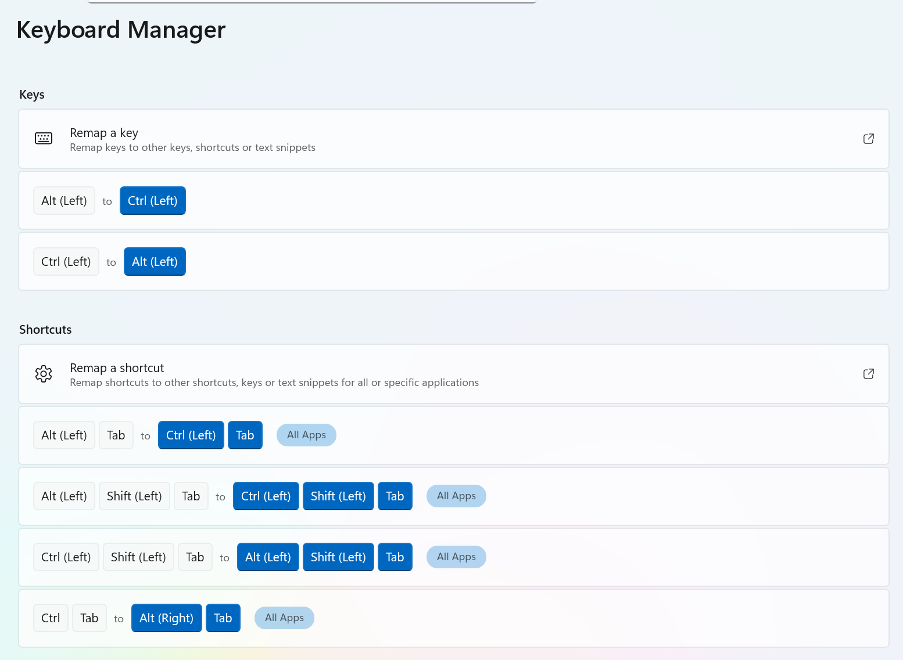

# WSL Mac Comfort Shell

You are in a Linux terminal running inside Windows via **WSL**. This repo provides an idempotent bootstrap script and onboarding notes to make that environment feel familiar to macOS developers.

## What this repo includes
- `wsl-mac-comfort-bootstrap.sh`: setup script with WSL checks, apt baseline, optional Homebrew install, zsh managed blocks, and Mac-like helper shims (`pbcopy`, `pbpaste`, `open`)
- `mac-my-wsl.ps1`: Windows-side helper that runs the bootstrap script in a target distro from your current repo folder (run without parameters for detailed help)
- `install-terminal-fragment.ps1`: installs a Windows Terminal JSON fragment extension that adds a Mac Comfort profile + color scheme
- `README.md`: onboarding guide and terminal personalization suggestions

## Prereqs
Before running setup:
- WSL installed and working on Windows (`wsl --status`)
- Ubuntu installed in WSL (for example `Ubuntu` or `Ubuntu-24.04`)
- Windows Terminal installed (recommended)
- A user in Ubuntu with sudo access

## Quick start
From inside your Ubuntu WSL shell:

```bash
mkdir -p ~/src
cd ~/src
git clone https://github.com/shanselman/MacLikeWSLComfortShell.git
cd MacLikeWSLComfortShell
chmod +x wsl-mac-comfort-bootstrap.sh
./wsl-mac-comfort-bootstrap.sh
```

If you already downloaded the script elsewhere, copy it into WSL and run it there:

```bash
cp /mnt/c/path/to/wsl-mac-comfort-bootstrap.sh ~/
chmod +x ~/wsl-mac-comfort-bootstrap.sh
~/wsl-mac-comfort-bootstrap.sh
```

## Quick start from a Windows repo clone (run from CWD)
If this repo is cloned on Windows and you are in this folder in PowerShell:

```powershell
wsl --install Ubuntu-24.04 --name MacComfort --no-launch
wsl -d MacComfort   # complete first-launch user creation
.\mac-my-wsl.ps1 -Distro MacComfort
```

If you already have a distro:

```powershell
.\mac-my-wsl.ps1 -Distro <YourDistroName>
```

Pass bootstrap flags through the wrapper with `-BootstrapArgs`:

```powershell
.\mac-my-wsl.ps1 -Distro <YourDistroName> -BootstrapArgs "--dry-run"
.\mac-my-wsl.ps1 -Distro <YourDistroName> -BootstrapArgs "--no-brew,--minimal"
```

Then optionally install the Mac Comfort Windows Terminal profile fragment:

```powershell
.\install-terminal-fragment.ps1 -Distro MacComfort
```

For a different distro name:

```powershell
.\install-terminal-fragment.ps1 -Distro <YourDistroName>
```

## Two common scenarios
### 1) New machine (new WSL + Ubuntu)
- Install WSL and Ubuntu.
- Clone this repo (Windows or WSL) and run bootstrap.
- Easiest from Windows clone: `.\mac-my-wsl.ps1 -Distro MacComfort`

### 2) Existing WSL distro (existing profiles)
- Run the script in your existing distro; it is designed to be rerun safely.
- It only updates managed blocks in `~/.zprofile` and `~/.zshrc` and avoids overwriting non-managed shim files unless `--force` is used.
- Recommended first run on an existing profile:
  ```bash
  ./wsl-mac-comfort-bootstrap.sh --dry-run
  ./wsl-mac-comfort-bootstrap.sh
  ```
- If you have multiple distros, target one explicitly:
  ```powershell
  wsl -l -q
  wsl -d <DistroName>
  .\mac-my-wsl.ps1 -Distro <DistroName> -BootstrapArgs "--dry-run"
  .\mac-my-wsl.ps1 -Distro <DistroName>
  ```

## What you get after running bootstrap (default flags)
- **zsh** as your shell (like modern macOS)
- **Homebrew (Linuxbrew)** so `brew install ...` works the way you expect
- **Build essentials**: `build-essential` is installed, giving you `make`, `gcc`, `g++`, and the C standard library headers needed to compile software from source
- A modern CLI toolbox:
  - `git`, `gh`
  - `rg` (ripgrep), `fd`, `bat`, `eza`, `fzf`
  - `jq`, `yq`, `direnv`, `starship` prompt

Notes:
- `--minimal` skips optional extras (for example plugin/tool installs)
- `--no-brew` skips Homebrew install and brew package installs

## Where your files should live
Use the Linux filesystem for coding:
- Put repos in: `~/src`
- Example:
  ```bash
  mkdir -p ~/src
  cd ~/src
  git clone <your-repo>
  ```

You *can* access Windows files at `/mnt/c/...`, but for dev builds and lots of small files it can be slower and sometimes weirder.

## The three commands you will use constantly
- Update packages:
  ```bash
  sudo apt update && sudo apt upgrade
  ```
- Install tools (Mac muscle memory):
  ```bash
  brew install <package>
  ```
- Search like a superhero:
  ```bash
  rg "some text" .
  ```

## Clipboard + "open" helpers (Mac-ish)
These commands behave like on macOS:

- Copy to clipboard:
  ```bash
  pbcopy < file.txt
  echo "hello" | pbcopy
  ```
- Paste from clipboard:
  ```bash
  pbpaste
  ```
- Open a URL in your default Windows browser:
  ```bash
  open https://example.com
  ```

The bootstrap also installs browser opener compatibility (`xdg-open`/`wslview` fallbacks) so tools like `gh auth login` can launch browser sign-in.

## VS Code (recommended workflow)
Best experience is VS Code with Remote WSL.  
From inside WSL, in a repo folder:

```bash
code .
```

That opens VS Code "connected" to Linux so terminals, tools, and paths all match.

## Terminal look and feel (Mac-friendly)
You will use **Windows Terminal** on the Windows side. Open **Settings**, select your **Ubuntu profile**, and apply these profile settings for a Mac-friendly feel:

- **Font face**:
  - `JetBrainsMono Nerd Font` (popular and polished; download: [latest zip](https://github.com/ryanoasis/nerd-fonts/releases/latest/download/JetBrainsMono.zip) or [Nerd Fonts downloads](https://www.nerdfonts.com/font-downloads))
  - `Cascadia Mono` (ships with Windows Terminal)
  - `Menlo` or `SF Mono` (if you already have them installed)
- **Font size**: `13` is a great default (`12-14` common)
- **Recommended color scheme**: `One Half Dark`
- **Other good color schemes**: `Solarized Dark` or `Campbell` (default)
- **Cursor shape**: `bar`

To apply these defaults automatically via JSON fragment extension, run:

```powershell
.\install-terminal-fragment.ps1 -Distro <YourDistroName>
```

This writes a fragment file to:
- Current user: `%LOCALAPPDATA%\Microsoft\Windows Terminal\Fragments\MacLikeWSLComfortShell\mac-comfort.fragment.json`
- All users (admin): `C:\ProgramData\Microsoft\Windows Terminal\Fragments\MacLikeWSLComfortShell\mac-comfort.fragment.json` via `-AllUsers`

### Windows Terminal profile snippet
In Windows Terminal settings JSON, profile-level example:

```json
{
  "font": {
    "face": "JetBrainsMono Nerd Font",
    "size": 13
  },
  "colorScheme": "One Half Dark",
  "cursorShape": "bar"
}
```

### Visual walkthrough (Ubuntu profile in Windows Terminal)
Use these in order while updating your Ubuntu profile settings:

1. Open Windows Terminal settings and select the Ubuntu profile  
   

2. Update font and appearance settings for a Mac-like look  
   

3. Confirm the profile colors and cursor settings  
   

## Keyboard comforts
Mac muscle memory relies on **Cmd+Backspace** (clear line) and **Option+Backspace** (delete word). Here is how to get that behavior on Windows.

### PowerShell
Add these to your `$PROFILE` (run `notepad $PROFILE` to edit):

```powershell
Set-PSReadLineKeyHandler -Chord Alt+Backspace -Function BackwardKillWord
Set-PSReadLineKeyHandler -Chord Ctrl+u -Function BackwardKillLine
```

- **Alt+Backspace** → delete previous word (like Option+Backspace on Mac)
- **Ctrl+U** → clear line to the left of cursor (like Cmd+Backspace on Mac)
- **Ctrl+Backspace** → delete previous word (already works by default)

### zsh (WSL)
These are already defaults in zsh, but for reference:

- **Alt+Backspace** → delete previous word ✅
- **Ctrl+U** → clear entire line ✅
- **Ctrl+W** → delete previous word ✅

### Why not Win+Backspace?
On a Mac keyboard, Cmd maps to the Win key on Windows. Unfortunately Win+key combos are intercepted by the OS before your terminal sees them, so Win+Backspace cannot be rebound inside the shell. The fix is **PowerToys Keyboard Manager** — use it to swap Win ↔ Ctrl system-wide so your Cmd muscle memory lands on Ctrl, then the shell bindings above just work automatically.

### PowerToys Keyboard Manager

[**PowerToys**](https://learn.microsoft.com/windows/powertoys/) is a free Microsoft utility suite for power users. Install it from the Microsoft Store or from the [GitHub releases page](https://github.com/microsoft/PowerToys/releases).

Once installed, open **PowerToys → [Keyboard Manager](https://learn.microsoft.com/windows/powertoys/keyboard-manager)** and remap keys or full shortcuts:

| What to remap | From | To | Effect |
|---|---|---|---|
| Key | Win (Left) | Ctrl (Left) | Cmd → Ctrl globally |
| Key | Ctrl (Left) | Win (Left) | Ctrl → Cmd (optional swap-back) |
| Shortcut | Win+C | Ctrl+C | Copy |
| Shortcut | Win+V | Ctrl+V | Paste |
| Shortcut | Win+Z | Ctrl+Z | Undo |
| Shortcut | Win+A | Ctrl+A | Select all |
| Shortcut | Win+S | Ctrl+S | Save |
| Shortcut | Win+T | Ctrl+T | New tab |
| Shortcut | Win+W | Ctrl+W | Close tab |

> **Tip:** Most people find it easier to remap the **Win and Ctrl keys** at the key level rather than mapping every individual shortcut. Once Win=Ctrl, everything else follows automatically.



## Helpful Mac-style tweaks
- Keep aliases in zsh for `ls`, `ll`, `lt`, `cat`, `grep`, and git shortcuts
- Use `tmux` with `Ctrl+a` prefix for split panes and persistent sessions
- Use `starship` for a clean, fast prompt
- Keep projects in `~/src`, not `/mnt/c/...`, for better performance

## Installing common stuff
Some useful installs:

```bash
brew install node
brew install python
brew install kubectl
brew install terraform
```

If you prefer apt for some things:

```bash
sudo apt install <package>
```

## Quick mental model
- This is **Linux**, not macOS, but it is configured to feel familiar.
- Use `brew` for most developer tools.
- Use `~/src` for code.
- Use `code .` for a smooth editor experience.

## If something feels off
Try:

1. Restart your terminal
2. Confirm shell:
   ```bash
   echo $SHELL
   ```
3. Confirm brew:
   ```bash
   brew --version
   ```

### Typing feels slow / laggy
The `zsh-syntax-highlighting` plugin re-parses the entire command line on every keystroke. Under WSL's slightly higher I/O overhead this can cause noticeable input lag. `zsh-autosuggestions` can add to it as well.

To test, comment them out in `~/.zshrc`:
```bash
#[ -f /usr/share/zsh-autosuggestions/zsh-autosuggestions.zsh ] && source /usr/share/zsh-autosuggestions/zsh-autosuggestions.zsh
#[ -f /usr/share/zsh-syntax-highlighting/zsh-syntax-highlighting.zsh ] && source /usr/share/zsh-syntax-highlighting/zsh-syntax-highlighting.zsh
```

Then `exec zsh -l` and see if it improves. Re-enable one at a time to find the culprit. Running `--minimal` skips both plugins during bootstrap.

Welcome!
